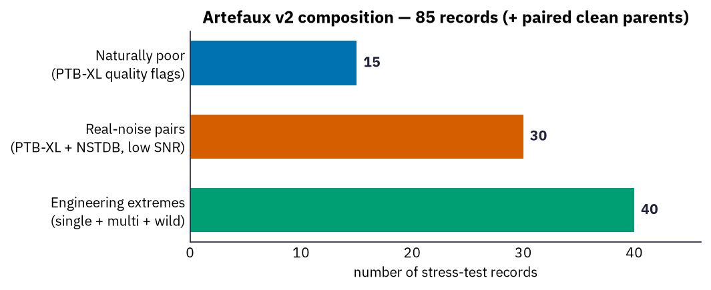
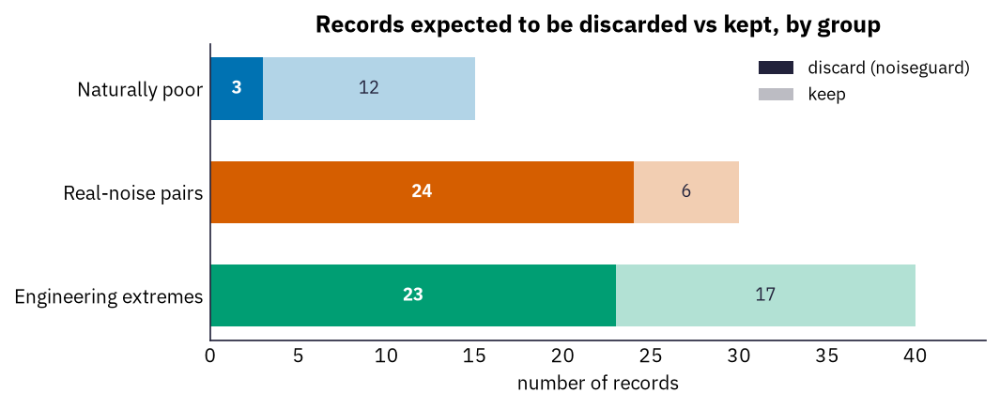

# Artefaux v2 — Discard / Extreme Stress Pack

**Ioannis Valasakis** · *Electrocardiography Group, University of Glasgow* · 2026-07-16

This is the plain-language companion to the v2 waveform review pack
(`reports/artefaux_v2_ecg_review.pdf`, rendered with every lead as a full 10-second strip).
v2 is deliberately **weighted toward clinically-unusable recordings**: **50 of 85**
records are expected to be discarded. It exists to stress a signal-quality gate where it
matters — near and beyond the point where an ECG stops being interpretable.

> **Scope.** A *stress-test set, not a clinically representative cohort.* It over-samples
> failure on purpose; do not read prevalence or deployment accuracy from it.

---

## 1. The three groups at a glance

The corpus is 85 stress records in three groups, each with its own colour throughout this
document and the figures.





| Group | n | Discard | Reject | Integrity failures | Source | Corruption |
|:--|--:|--:|--:|--:|:--|:--|
| Naturally poor | 15 | 3 | 3 | 0 | PTB-XL (quality flags) | none (inherently noisy) |
| Real-noise (low-SNR) | 30 | 24 | 2 | 0 | clean PTB-XL + NSTDB | NSTDB `em`/`ma`/`bw` @ {-6, -4, -2, +0, +2} dB |
| Engineering extremes | 40 | 23 | 5 | 22 | clean PTB-XL (+ MACECGDB) | deterministic acquisition failures |
| **Total** | **85** | **50** | **10** | **22** | | |

---

## 2. What each group is for

**Naturally poor (15) — real-world noisy reference.** Genuine PTB-XL
12-lead ECGs flagged by PTB-XL's own technical-validation quality columns (`static_noise`,
`burst_noise`, `baseline_drift`, `electrodes_problems`). No synthetic corruption and no clean
parent — this is what real acquisition noise looks like, and it anchors the engineered cases
against reality. The severe electrode-problem records are labelled reject/discard; the rest are
`limited` but genuinely noisy.

**Real-noise (30) — a controlled low-SNR dose–response.** Clean PTB-XL
parents mixed with real MIT-BIH NSTDB noise (`em` electrode motion, `ma` muscle artefact, `bw`
baseline wander) at a fixed, *aggressive-low* SNR ladder {-6, -4, -2, +0, +2} dB. Unlike v1's clean-to-noisy
ladder, v2 drops the easy end and concentrates on the accept/reject decision region, so a
detector's behaviour can be traced as a function of severity rather than measured at a single
point. Each ships with its untouched clean parent (`*_clean`) for paired comparison.

**Engineering extremes (40) — deterministic acquisition failures.**
Recipe-built breakage rather than added noise: rail-clipping saturation, flat / stuck-constant /
disconnected / digital-missing (NaN) channels, huge electrode-motion swings, step-and-recovery
baseline shifts, polarity reversal, intermittent lead-off, and compound "wild" multi-mode records.
Single-lead, multi-lead, and whole-precordium variants exercise both per-lead and record-level gate
logic.

---

## 3. How labels are assigned

Every record carries three label layers: the **clinical parent** (authored rhythm class + PTB-XL
quality flags), the **corruption truth** (exact leads/electrodes, artefact, requested + measured SNR,
seed, amplitude bookkeeping), and the **expected behaviour** (what a correctly-tuned gate should do).
Labels are authored from the recipe — never by running a detector.

Expected behaviour is written in **two deliberately different vocabularies**: `signalguard` (a graded
record verdict — `diagnostic` / `limited` / `rhythm_only` / `reject`, plus a per-lead
`good`/`borderline`/`bad`) and `noiseguard` (a binary record-level *discard*). A record can be
`limited` for one and `discard=false` for the other; the label captures both.

**Real-noise: SNR → label.** For whole-record contamination the bands are (generated from the
definition, so they match the corpus exactly):

| SNR (dB) | Record quality | Lead quality | Discard |
|:--:|:--|:--|:--:|
| -6 | reject | bad | yes |
| -4 | limited | bad | yes |
| -2 | limited | bad | yes |
| +0 | limited | borderline | yes |
| +2 | limited | borderline | — |

Subset (limb- or chest-only) contamination degrades only the touched half, so the record stays
`limited` and discards only at or below 0 dB.

**Naturally poor.** Severe electrode-problem records are `reject` / discard; the remaining
quality-flagged records are `limited` and kept.

**Engineering.** Labels are authored per failure mode from what the recipe actually does to each lead.
Crucially, **NaN / flat / stuck-constant / rail-saturated cases are labelled
`data_integrity_failure` with a specific `integrity_failure_type` — not as noise** — because they are
acquisition/software faults a gate must catch by a different route than a low SNR.

---

## 4. The waveform pack

The companion `reports/artefaux_v2_ecg_review.pdf` renders each record with **every independent lead
(I, II, V1–V6) as its own full 10-second strip** (25 mm/s, 10 mm/mV, diagnostic filter), so a reviewer
sees each lead's complete recording at once and rail-clipping shows honestly as a `clipped` marker.
Regenerate the whole set with:

```bash
make regenerate                                              # build out/artefaux-v2 from local sources
python scripts/reports/render_ecg_review.py --layout strip8  # -> reports/artefaux_v2_ecg_review.pdf
python scripts/reports/generate_v2_explainer.py --pdf        # this document
```

---

*Generated by Artefaux v2.0.0 (<https://github.com/depolarised/artefaux>) via
`scripts/reports/generate_v2_explainer.py`; every count and the SNR→label table are computed from the
committed corpus definition.*
